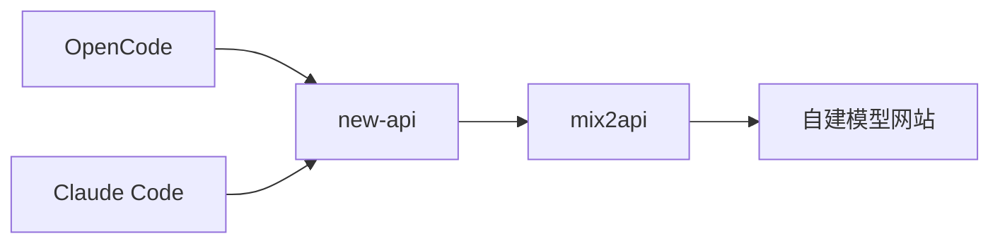

# Product Brief: mix2api

<!-- Content will be appended sequentially through collaborative workflow steps -->

## Executive Summary

**一句话定位（内部版）**：mix2api 是 new-api 后置的内部上游适配层（provider），把自建模型网站输出为**语义稳定的 OpenAI Chat Completions**（tools 闭环 + SSE streaming，MCP 链路不破坏），以**可观测优先 + 最小状态（可选 Redis）**保障 OpenCode/Claude Code 近期可用并可验收。

**目标用户**：内部研发/平台团队（需要让 IDE 智能体稳定可用，并且能灰度、能回滚、能归因）。

**我们做什么 / 不做什么（先写死边界，避免范围爆炸）**
- ✅ 做：
  - 北向：仅提供 OpenAI **Chat Completions**（重点：`stream` + `tools/tool_calls` 语义一致）
  - 南向：token 生命周期（获取/续期/失败重登）、上游 sessionId/exchangeId 提取与复用、错误形态规范化
  - MCP-safe：MCP 相关工具形态在链路中**不破坏**（默认不承诺服务端执行 MCP）
  - 可观测：按 client×stream×tools 拆分统计与归因（`end_reason`）
  - 灰度回滚：配合 new-api 权重灰度（stable/canary 双容器）
- ❌ 不做（WON’T）：
  - 不替代 new-api 控制面（用户/Key/配额/计费/路由治理/管理台）
  - 不承诺 `/responses`
  - 短期不做完整服务端 MCP Gateway（仅保证不破坏）

**Success Metrics（MVP SLO，rolling 24h，OpenCode 与 Claude Code 分别统计，排除 `client_abort`）**

| 指标 | 统计口径（建议以服务端 end_reason 为准） | 阈值（MVP） |
| --- | --- | --- |
| 请求成功率 | `end_reason=ok` /（总请求 - `client_abort`） | ≥ 99.0% |
| 工具调用成功率 | 在出现 `tool_calls` 的请求中：闭环完成 `assistant(tool_calls) → tool(result) → assistant(final)` /（总 - `client_abort`） | ≥ 97.0% |
| 断流率 | 在 `stream=true` 的请求中：未正常完成（非 `client_abort`，且未发出完成信号）/（总 - `client_abort`） | ≤ 0.5% |

**MVP Done（强约束）**：仅 Chat Completions（含 stream+tools），OpenCode 与 Claude Code 两端分别 rolling 24h 达到以上 MVP SLO，且最小回归包（A/B/C）全绿。

---

## Core Vision

### Problem Statement

团队希望让 OpenCode/Claude Code 通过 new-api 访问自建模型网站能力，但在多跳链路中，“OpenAI 兼容”不再是字段对齐问题，而是**语义契约**：tools 闭环、`tool_call_id` 对齐、SSE 事件顺序、结束信号与断连处理任何一处不确定，都会放大为 IDE 智能体不可预测行为（工具不触发/回填失败/中途断流/提前结束），从而让开发工作流不可用。

工具生态正在向 MCP 扩张：短期 mix2api 不承诺服务端执行 MCP，但必须做到 **MCP-safe（链路不破坏、行为可解释）**，否则会破坏上层智能体能力并放大排障成本。

### Problem Impact

- 生产力损失：频繁重试、人工介入、排障时间飙升
- 稳定性不可验收：偶发、不可复现，团队无法形成质量门槛
- new-api 生态价值无法释放：统一入口/治理/路由难以用于真实生产工作流
- 潜在安全与隔离风险：会话串扰、敏感信息在日志/观测链路泄露

### Why Existing Solutions Fall Short

- new-api 是入口治理与分发平台，但“非标准上游”的适配（token/session/流式/异常形态）需要专门的内部适配层承接，否则兼容问题在多跳链路中被放大。
- 通用代理/网关很难开箱即用地同时满足：自建上游认证现实 + tool_calls 严格闭环 + SSE 细节稳定；额外网关层也会增加运维与观测复杂度。
- 缺少端到端可观测与一致性回归矩阵时，稳定性无法被工程化验收与持续改进。

### Proposed Solution

**架构分层（new-api first）**

- new-api（入口）负责：用户/Key/配额/路由、灰度与一键回滚
- mix2api（内部适配层）负责：
  - 北向：OpenAI Chat Completions 的 tools/streaming 语义一致性（仅此端点范围）
  - 南向：token 生命周期、上游 session 复用、错误规范化与超时/重试策略
  - MCP-safe：不破坏 MCP 相关工具形态（不承诺执行）

**最小回归包（两端各跑一遍）**

- A：`stream=true` + 无 tools（长输出/多段 SSE）→ 不断流、正确结束、end_reason=ok
- B：`stream=true` + 有 tools（最小 1 工具）→ tool_calls 闭环完成、tool_call_id 对齐
- C：取消/超时 → `client_abort` 不计失败且资源释放

**里程碑（M0–M2）**

- M0（0.5–1 天）：可观测口径 + 回归基线 + new-api stable/canary channel 就绪（先能归因）
- M1（2–4 天）：stream 语义 + token/session 适配稳定；两端分别达成成功率≥99.0%、断流≤0.5%
- M2（2–5 天）：tools 闭环稳定（tool_call_id 对齐）；两端分别达成 MVP SLO；可选 Redis 支持多实例

**灰度与回滚（new-api 权重 + stable/canary 双容器）**

- 权重：0%→5%→20%→50%→100%
- 短窗回滚（10–15min 滑窗，任一满足即回滚到 0%）：
  - adapter_error > 0.5% 或 5xx > 1% 或 非 client_abort 断流 > 1%

**共享 Redis（stable/canary 共用）的兼容契约**

- 前置条件：上游身份一致性（若上游 sessionId 强绑定 token/login 态，则 stable/canary 需共享 token store 或统一身份）
- schemaVersion 前后兼容（只能新增可选字段）
- 解析失败/未知 version → 当 miss 自动新会话（不得让请求失败）
- 会话隔离优先：按 auth 指纹/显式 header 进行 session key 隔离

### Key Differentiators

- Semantic Compatibility：以 tools 闭环 + SSE 语义一致性为第一目标（可预测、可回归）
- Upstream Reality Fit：token/session/异常形态是一等公民（不把复杂度甩给 new-api 或客户端）
- new-api First + 可灰度可回滚：权重灰度 + 一键回滚，稳定性可工程化推进
- MCP-safe by Design：不破坏 MCP 工具链路，为后续演进留扩展位
- Observability First：按 client×stream×tools 拆分的可观测与归因体系，支撑“分别达标”的验收策略

---

## Target Users

### Primary Users

#### Persona 1：AI 工程师（最典型主用户）

- **姓名/背景**：林泽（28），AI/应用工程师，负责把 IDE 智能体（OpenCode / Claude Code）接入团队内部模型能力，并确保日常开发可用。
- **工作环境**：
  - 入口统一走 new-api；mix2api 作为 new-api 后置 provider；上游是“自建模型网站”（需要 token/session 适配）
  - 日常依赖 streaming 与 tools（多轮工具调用闭环）
- **目标/动机**：
  - 让智能体在真实开发任务中稳定完成：不断流、工具能调用且闭环、不会“莫名提前结束”
  - 让问题可定位：看到 request-id/end_reason 就能归因，不靠猜
- **当前痛点**：
  - tools 闭环不稳定（tool_call_id 对齐、回填后不继续、或模型直接收尾）
  - SSE 偶发断流/结束信号不一致，导致 IDE 侧表现为“卡住/提前结束”
  - 上游 token 过期或 session 丢失导致体验随机失败
- **现有替代/权宜之计**：
  - 手工重试/切模型/关 tools；或者临时改提示词规避
  - 通过抓包/日志猜原因（但缺少统一口径与 end_reason）
- **成功定义（TA 视角）**：
  - OpenCode 与 Claude Code 两端分别 rolling 24h 达到 MVP SLO
  - 回归包 A/B/C 全绿；问题能按 end_reason 快速定位并修复

#### Persona 2：平台/基础设施工程师（链路 Owner）

- **姓名/背景**：周宁（32），平台工程师，负责 new-api 渠道治理与内部服务（mix2api）稳定性、灰度与回滚。
- **工作环境**：
  - Docker/Compose 为主（不引入 K8s）；需要 stable/canary 双容器与权重灰度
  - 需要最小状态，必要时用 Redis 做多实例一致性
- **目标/动机**：
  - 把“稳定”工程化：SLO 可统计、可拆分（client×stream×tools）、可回滚
  - 控制风险面：mix2api 不替代 new-api 控制面，不做范围爆炸
- **当前痛点**：
  - 多跳链路故障责任难归属（上游/new-api/mix2api/客户端）
  - 灰度时会话漂移：请求落不同实例导致 session 复用不稳定
  - 共享 Redis 的前后兼容与降级策略若没写死，灰度会翻车
- **成功定义（TA 视角）**：
  - stable/canary 权重灰度可执行：0→5→20→50→100
  - 短窗回滚门槛明确且可自动触发；回滚后能定位 Top 原因

### Secondary Users

- **Tech Lead / 研发负责人**：关心“近期必达是否可验收”、里程碑是否可控、风险与回滚是否一键可执行。
- **SRE/运维**：关心告警、容量、P95 延迟、以及断流/超时是否能从指标快速分型。
- **安全/合规**：关心默认脱敏、仅信任 new-api 的访问边界、以及 MCP 工具生态扩张带来的风险控制（当前阶段以 MCP-safe 为底线）。

### User Journey

#### AI 工程师旅程（主线）

- **Discovery**：因为 tools/断流问题影响开发效率，提出“必须把链路做成可验收的工程契约”
- **Onboarding**：
  - new-api 配置 channel 指向 mix2api（stable/canary）
  - 在 IDE（OpenCode/Claude Code）配置入口并跑最小回归包 A/B/C
- **Core Usage**：
  - 日常用智能体写/改代码，依赖 streaming 与 tools
  - 遇到失败时按 request-id + end_reason 归因（adapter_error/upstream_error/timeout 等）
- **Success Moment（Aha）**：
  - 连续多次任务稳定：不断流、tool_calls 闭环可靠
  - 出问题能复现并定位：回滚/修复有节奏，不再“玄学”
- **Long-term**：
  - 跟随 mix2api 版本迭代走权重灰度；SLO 连续达标再收紧阈值
  - 工具生态扩张时保持 MCP-safe，并按需规划服务端 MCP Gateway 的独立立项

---

## Success Metrics

mix2api 的“成功”按三层定义：**用户成功（体验/行为）**、**工程验收（SLO）**、**交付运营（灰度/回滚/可观测）**。当前阶段以“2 人、2 周、不断流 + tools 闭环不翻车、可验收可归因”为第一优先级；成本/性能暂不设硬门槛。

### 用户成功（User Outcomes）

- **验收周期**：2 周（以 2026-02-11 起算，截止 2026-02-25）
- **核心用户规模**：2 人
- **用户侧验收标准（必须同时满足）**
  1) **不断流可感知**：在 OpenCode 与 Claude Code 的真实开发任务中，`stream=true` 不出现“卡住/半截断/无完成信号”的体验；对应服务端指标为「非 `client_abort` 断流率」满足 MVP SLO（≤ 0.5%）。
  2) **工具闭环可用**：需要工具的任务可稳定走完 `assistant(tool_calls) → tool(result) → assistant(final)`，不依赖“关 tools / 改提示词”规避；对应服务端指标为「工具调用成功率」满足 MVP SLO（≥ 97.0%，仅统计出现 `tool_calls` 的请求集）。
  3) **失败可定位**：任一失败都能通过 `request_id + end_reason` 在 10 分钟内归因到 `upstream / new-api / mix2api / client` 中至少一类（用于修复或回滚决策）。

### 工程验收（SLO / Quality Gate）

- **统计口径**：rolling 24h；按 client（OpenCode、Claude Code）分别统计；排除 `client_abort`；以服务端 `end_reason` 为准。
- **MVP SLO（验收门槛）**：见 Executive Summary 中的表格（请求成功率 / 工具调用成功率 / 断流率）。

### 交付与运营（Release / Operability）

- **灰度可执行**：支持 new-api 权重 0%→5%→20%→50%→100%，并保持 stable/canary 双容器可切换。
- **回滚可触发**：10–15min 滑窗内，任一满足即回滚到 0%（以避免“工具/断流”体验放大）：
  - `adapter_error` > 0.5% 或
  - 5xx > 1% 或
  - 非 `client_abort` 断流 > 1%
- **可观测完备**：100% 请求具备 `request_id`，并打点最小维度：`client`、`stream`、`tools_present`、`end_reason`、`http_status`、`upstream_status`（用于按 client×stream×tools 拆分验收与归因）。

### Business Objectives

- **2 周内（≤ 2026-02-25）**：OpenCode 与 Claude Code 两端分别达到 MVP SLO，且用户侧“不断流 + tools 闭环 + 可归因”三条验收标准成立（2 人可用、可验收）。
- **3 个月内（≤ 2026-05-11）**：形成可持续交付节奏：每次变更均可按 stable/canary 灰度发布并可回滚；核心指标可持续观测（按 client×stream×tools 拆分），支持按 Top end_reason 驱动迭代。
- **12 个月内（≤ 2027-02-11）**：稳定保持对 new-api 生态的强绑定与兼容不回归（Chat Completions 的 stream+tools 语义一致性作为长期质量门槛），并为后续更大范围能力（如服务端 MCP Gateway 或其它接口扩展）保留清晰的独立验收指标体系。

### Key Performance Indicators

- **KPI-1 请求成功率**：`end_reason=ok / (total - client_abort)` ≥ 99.0%（按 client 分开，rolling 24h）。
- **KPI-2 工具调用成功率**：在出现 `tool_calls` 的请求中，闭环完成占比 ≥ 97.0%（按 client 分开，rolling 24h）。
- **KPI-3 断流率**：`stream=true` 且非 `client_abort` 的未正常完成占比 ≤ 0.5%（按 client 分开，rolling 24h）。
- **KPI-4 归因覆盖率**：非成功请求中，`end_reason != unknown` 的占比 ≥ 99%（rolling 24h）。
- **KPI-5 回归包通过率**：最小回归包 A/B/C 在 stable 与 canary 上均为 100% 通过（作为灰度前置门槛）。
- **KPI-6 回滚时效**：触发阈值后，new-api 权重回滚到 0% 的完成时间 ≤ 10 分钟（用于控制体验扩散）。

---

## MVP Scope

### Core Features

1) **北向接口：仅 OpenAI Chat Completions**
- 提供 `POST /v1/chat/completions`（MVP 不扩展到 `/responses`）。
- 重点保证 OpenCode / Claude Code 在该端点上的**语义一致性**：字段对齐只是底线，关键是行为可预测、可回归。

2) **SSE Streaming（不断流优先）**
- `stream=true` 的 SSE 事件顺序、增量语义、结束信号稳定可靠；避免“半截断/卡住/无完成信号”。
- 断连/超时/上游异常统一归因（`end_reason`），并可用于回滚决策。

3) **Tools 闭环（不翻车）**
- 严格闭环：`assistant(tool_calls) → tool(result) → assistant(final)`。
- `tool_call_id` 关联一致、回填后能继续生成，不依赖“关 tools / 改提示词”规避。

4) **可观测与归因（Observability First）**
- 每个请求都有 `request_id`，并打点最小维度：`client`、`stream`、`tools_present`、`end_reason`、`http_status`、`upstream_status`。
- 按 client×stream×tools 拆分统计，支撑“OpenCode 与 Claude Code 分别达标”的验收方式。

5) **灰度与回滚（new-api first）**
- 支持 stable/canary 双容器配合 new-api 权重灰度：0%→5%→20%→50%→100%。
- 支持短窗回滚阈值（按 Success Metrics 定义），确保体验问题可快速止损。

6) **共享 Redis（默认开启）**
- Redis 用于 token/session 等最小必要状态，保障 stable/canary 灰度时会话一致性，避免实例漂移导致的随机失败。
- 前后兼容：schemaVersion 只增不改；解析失败/未知版本按 miss 处理（自动新会话，不得让请求失败）。
- 会话隔离：按 auth 指纹/显式 header 做 key 隔离，避免串话。

### Out of Scope for MVP

- `/responses` 及其它非 Chat Completions 体系端点（Assistants/Realtime 等）。
- **服务端 MCP Gateway**（MVP 仅保证 MCP-safe：链路不破坏，不承诺执行）。
- new-api 控制面能力：用户/Key/配额/计费/管理台/路由治理等（全部仍由 new-api 负责）。
- 管理后台、可视化配置中心、复杂审计台账等“平台化 UI”。
- 多上游聚合与复杂路由策略（多模型自动选择/回退/AB 策略编排等）。
- 复杂缓存/长时记忆/提示词管理平台。
- K8s/Service Mesh 等重运维形态（MVP 以 Docker/Compose 为主）。

### MVP Success Criteria

- **时间窗口**：2 周（2026-02-11 ～ 2026-02-25），**核心用户**：2 人。
- **SLO 达标**：OpenCode 与 Claude Code 两端分别 rolling 24h 达到 MVP SLO（请求成功率/工具闭环成功率/断流率，排除 `client_abort`）。
- **体验验收（不断流）**：用户侧不再出现“卡住/半截断/无完成信号”的高频问题；断流问题可通过 `end_reason` 归因并可触发回滚。
- **回归门槛**：最小回归包 A/B/C 全绿（stable 与 canary 均通过），作为灰度放量前置条件。
- **可运维门槛**：灰度放量与回滚策略可执行、可复盘（指标与 Top end_reason 可驱动迭代）。

### Future Vision

- **对 IDE 侧“无感”**：Claude Code / OpenCode 使用起来与官方对应型号模型无差别（语义、稳定性、工具闭环、流式体验一致）。
- 在不破坏既有契约的前提下，逐步扩展：
  - 完整覆盖更多 OpenAI 生态能力（在充分验证后再引入，例如 `/responses`）。
  - 视需求独立立项演进“服务端 MCP Gateway”（从 MCP-safe 升级到可执行与可治理）。
  - 更强的上游适配与质量门槛（异常形态、限流、重试、降级策略标准化），让兼容性长期不回归。
