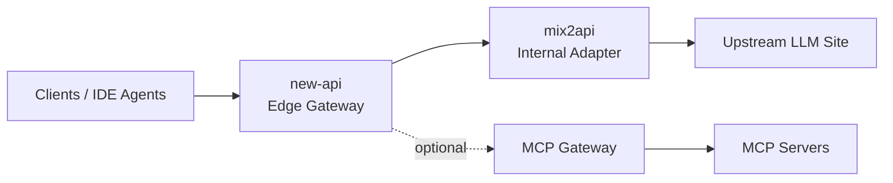
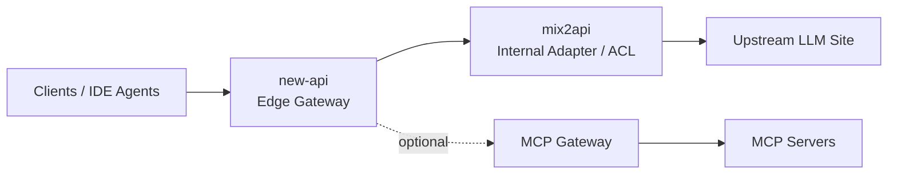
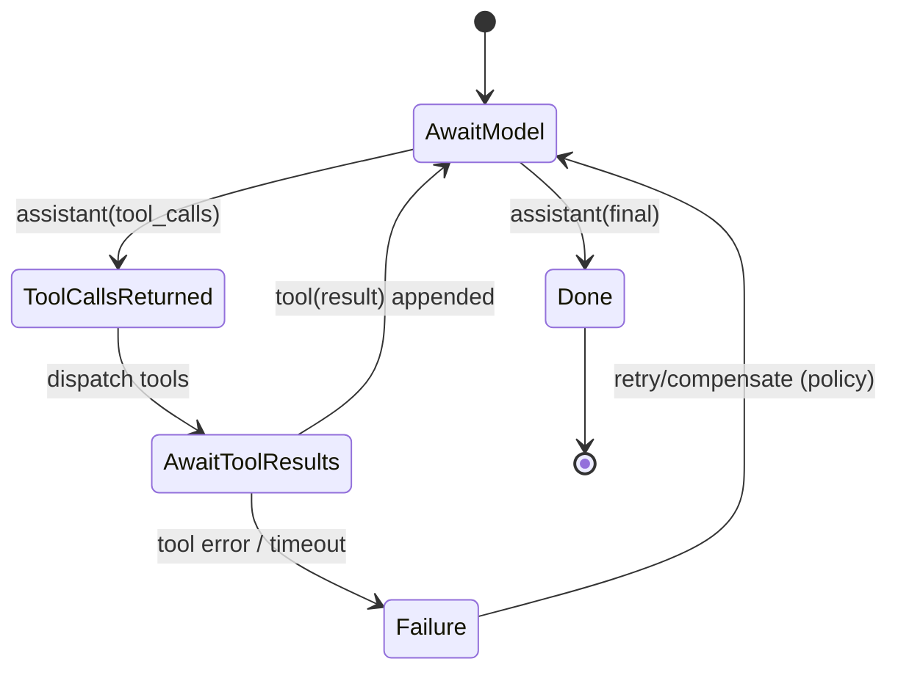

# Research Report: technical

**Date:** 2026-02-10
**Author:** 皇上
**Research Type:** technical

---

## Research Overview

[Research overview and methodology will be appended here]

---

<!-- Content will be appended sequentially through research workflow steps -->

## Technical Research Scope Confirmation

**Research Topic:** LLM 网关 / OpenAI Chat Completions 兼容适配层（new-api 生态）与 MCP/工具调用生态
**Research Goals:** 用于优化产品；深挖（2026 年 2 月，最多深挖近 3 个月内的数据）

**Technical Research Scope:**

- Architecture Analysis - design patterns, frameworks, system architecture
- Implementation Approaches - development methodologies, coding patterns
- Technology Stack - languages, frameworks, tools, platforms
- Integration Patterns - APIs, protocols, interoperability
- Performance Considerations - scalability, optimization, patterns

**Research Methodology:**

- Current web data with rigorous source verification
- Multi-source validation for critical technical claims
- Confidence level framework for uncertain information
- Comprehensive technical coverage with architecture-specific insights

**Scope Confirmed:** 2026-02-10

## Technology Stack Analysis

> 深挖窗口（以公开可检索来源为准）：2025-11-10 ～ 2026-02-10。  
> 说明：本节聚焦“实现网关/适配层与工具生态所需的技术栈要素”，以代表性开源项目与官方规范为锚点；对“趋势/常见做法”会标注置信度与假设前提。

### Programming Languages

从代表性开源网关/适配层项目的 GitHub 语言统计看，该领域的主流实现语言集中在 **Python / TypeScript( Node.js ) / Go** 三个阵营（不同项目可能同时包含多语言组件，例如控制台前端、脚本、部署文件等）：

- **LiteLLM**：以 Python 为主（约 83.9%），同时包含一定比例的 TypeScript（约 14.1%）。  
- **new-api**：Go（约 47.0%）与 JavaScript（约 52.4%）并存，体现“后端网关 + Web 控制台/管理端”的典型组合。  
- **Portkey AI Gateway**：以 TypeScript 为主（约 96.1%），强调快速集成与多部署形态。  

对“OpenAI Chat Completions 兼容适配层 + 工具调用闭环”而言，语言选择的核心不是“能不能转发”，而是是否容易把关键语义做对并长期维护：

- **流式 SSE 语义与 backpressure**：需要良好的 HTTP 流式输出控制（例如及时 flush、断连处理、代理层缓冲策略）；Go/Node 都较常见。  
- **工具调用（tool_calls）结构化输出**：需要稳定的 JSON 生成/校验、以及对并行工具调用/多轮工具闭环的状态管理；TypeScript 在 schema 约束与工程化上更占优。  
- **性能与扩展性**：Go 更适合做“高吞吐转发 + 低开销中间件”，Python 更适合快速验证与生态扩展，但在高并发与流式细节上需要更谨慎的工程实现。  

_Popular Languages: Python / TypeScript / Go（置信度：高；基于 GitHub languages 统计）_  
_Source:_  
- <https://api.github.com/repos/BerriAI/litellm/languages>  
- <https://api.github.com/repos/QuantumNous/new-api/languages>  
- <https://api.github.com/repos/Portkey-AI/gateway/languages>

### Frameworks and Libraries

在“网关/适配层 + 工具/协议生态”里，真正决定兼容性与闭环稳定性的不是某个具体 Web 框架，而是**协议层与结构化约束**：

- **OpenAI Chat Completions 协议栈**：兼容层需要正确处理 `messages`、`tools`、`tool_calls` 以及流式输出等关键字段与语义；函数/工具调用的结构与约束以 OpenAI 官方指南为准。  
- **Streaming（SSE）**：流式输出属于“强约束点”；要特别关注代理/负载均衡对 `text/event-stream` 的缓冲、分块与断开重连行为，否则会出现“上游在流式、下游卡住/丢块”的隐性问题。  
- **MCP（Model Context Protocol）**：当你把“工具生态”从纯函数调用扩展到 MCP server 目录与多语言 SDK 时，建议以 MCP 官方规范与 SDK 作为 schema/传输/鉴权的基线，避免私有方言导致的互操作性问题。  

_Key Libraries/Specs: OpenAI function calling & streaming docs；MCP specification & SDK（置信度：高；基于官方文档/规范）_  
_Source:_  
- <https://developers.openai.com/api/docs/guides/function-calling>  
- <https://developers.openai.com/api/docs/guides/streaming-responses>  
- <https://developers.openai.com/api/docs/api-reference/chat/create-chat-completion>  
- <https://github.com/modelcontextprotocol/specification>  
- <https://github.com/modelcontextprotocol/typescript-sdk>

### Database and Storage Technologies

对 LLM 网关/聚合分发系统而言，“是否需要数据库”取决于你要不要做 **Key/用户/配额/计费/审计/路由策略** 等治理能力：只做轻量协议适配（如纯转发+少量状态）可以不落库；一旦涉及管理后台与资产管理，通常需要持久化层。

以 **new-api** 为例，其 Docker 快速启动明确给出：

- **SQLite（默认）**：适合单机/轻量自托管，降低入门成本。  
- **MySQL（可选）**：适合多实例/更强治理场景（也更利于迁移与运维工具配套）。  

结合你的产品目标（作为 new-api 的内部上游适配层），更常见的落点是：

- “网关本体（mix2api）尽量无状态/少状态”，把账户/配额/计费等治理留给 new-api；  
- 但可以考虑为“观测与审计”预留可插拔存储（例如按需写入结构化日志到外部系统），避免把数据库耦合进转发链路的 P99。  

_Primary Datastores (example): SQLite default + MySQL option in new-api（置信度：高；基于项目文档）_  
_Source:_  
- <https://github.com/QuantumNous/new-api>

### Development Tools and Platforms

从代表性项目的“快速启动与开发体验”可以看到该生态在工具链上更偏向“开源常见栈 + 容器化/脚手架”：

- **Node.js / npm / npx**：Portkey Gateway 以 `npx @portkey-ai/gateway` 方式快速启动（强调低门槛与快速集成）。  
- **Docker / Docker Compose**：new-api 明确提供 Docker Compose 与镜像运行方式，适合团队化部署与环境一致性。  
- **多语言 SDK 与协议库**：MCP 提供 TypeScript SDK 等多语言接入基座，用于快速构建 MCP client/server 侧能力。  

_Tooling Signals: npx quickstart + Docker-first deployment（置信度：高；基于项目 README/仓库）_  
_Source:_  
- <https://github.com/Portkey-AI/gateway>  
- <https://github.com/QuantumNous/new-api>  
- <https://github.com/modelcontextprotocol/typescript-sdk>

### Cloud Infrastructure and Deployment

该领域的部署形态呈现“**容器化为主 + 同时拥抱边缘/Serverless**”的组合趋势：

- **传统云/主机**：Portkey README 展示了 AWS EC2 等部署入口；new-api 也以 Docker Compose 为推荐启动方式，适合私有化与可控运维。  
- **容器化**：Docker 仍是最通用的交付形态（便于统一网络、日志、反向代理与观测）。  
- **边缘/Serverless**：Portkey README 列出 Cloudflare 等部署选项，反映“低延迟边缘代理 + 统一 OpenAI 兼容入口”的需求正在上升。  
- **流式链路注意事项**：只要涉及 OpenAI 风格 streaming，就必须验证全链路（网关 → 反代 → LB → 客户端）是否对 SSE 友好；否则会出现看似“偶发”的卡流、延迟飙升与资源占用问题。  

_Deployment Options: Docker/Node/Cloudflare/EC2 + streaming constraints（置信度：中高；项目 README + OpenAI streaming 指南）_  
_Source:_  
- <https://github.com/Portkey-AI/gateway>  
- <https://github.com/QuantumNous/new-api>  
- <https://developers.openai.com/api/docs/guides/streaming-responses>

### Technology Adoption Trends

结合近期开源项目定位与官方协议演进，可以总结出几个对产品优化更“可行动”的技术趋势：

1) **“OpenAI Compatible” 仍是事实接口层**：new-api 主打多格式互转并覆盖 OpenAI 兼容；Portkey 明确提供 OpenAI compatible client 的接入路径。  
2) **工具调用进入强约束时代**：函数/工具调用（`tools` / `tool_calls`）与 streaming 已成为主流需求，兼容层必须把“字段兼容 + 状态机闭环 + 断点恢复/重试”作为核心工程能力，而不是附加功能。  
3) **MCP 正在把工具生态从“函数列表”推进到“协议化互操作”**：规范与 SDK 的成熟，意味着未来工具生态会更依赖标准化的 server 目录、鉴权与可观测（这会抬高网关对安全与治理的最低要求）。  
4) **API 面正在扩展**：OpenAI 官方文档同时存在 Chat Completions 与 Responses 等多种端点形态；对“只做 Chat Completions 兼容”的网关来说，短期可聚焦兼容闭环，长期需评估是否增加对新端点/能力的桥接层。  

_Trend Confidence: 1/2/3 高（文档/项目定位直接佐证）；4 中（需要结合你目标客户与 new-api 路线做取舍）_  
_Source:_  
- <https://github.com/QuantumNous/new-api>  
- <https://github.com/Portkey-AI/gateway>  
- <https://developers.openai.com/api/docs/guides/function-calling>  
- <https://developers.openai.com/api/docs/api-reference/chat/create-chat-completion>  
- <https://github.com/modelcontextprotocol/specification>  
- <https://modelcontextprotocol.io>  
- <https://developers.openai.com/api/docs/models/gpt-5-pro>

## Integration Patterns Analysis

> 深挖窗口（以公开可检索来源为准）：2025-11-10 ～ 2026-02-10。  
> 说明：本节聚焦“在 new-api 生态下，做 OpenAI Chat Completions 兼容适配层（mix2api 这类内部上游）时，哪些集成点最容易出错、以及如何用成熟模式把它做稳”。  

### API Design Patterns

对 LLM 网关/适配层而言，API 设计最重要的不是“暴露多少接口”，而是把 **兼容契约** 与 **职责边界** 定义清楚：

- **OpenAI Compatible Facade**：以 OpenAI（Chat Completions）为北向稳定契约；南向对接任意上游（供应商/自建模型站点），通过“字段映射 + 语义补齐 + 错误规范化”来隔离变化。  
- **双层网关（edge gateway + internal adapter）**：把用户/Key/配额/计费/路由等治理能力留在 new-api；mix2api 聚焦协议适配与工具闭环，避免重复实现（也减少攻击面与运维复杂度）。  
- **API Gateway Pattern（Routing/Aggregation/Offloading）**：将路由（按模型/供应商/策略）、聚合（必要时合并请求）、以及 TLS/鉴权等跨切面能力放到网关层，从而让内部服务更简单（该模式也常被称为 BFF）。  

_API Patterns: OpenAI-compatible facade；API gateway routing/offloading；BFF/双层网关（置信度：高；有成熟微服务模式支撑，且与 new-api + mix2api 的职责分层一致）_  
_Source:_  
- <https://learn.microsoft.com/en-us/dotnet/architecture/microservices/architect-microservice-container-applications/direct-client-to-microservice-communication-versus-the-api-gateway-pattern>  
- <https://learn.microsoft.com/en-us/azure/architecture/microservices/design/gateway>  
- <https://learn.microsoft.com/en-us/azure/architecture/microservices/design/patterns>

### Communication Protocols

“协议/流式”是 OpenAI Compatible 适配层的高风险区，常见坑来自：反向代理缓冲、SSE 分块策略、断连重试、以及不同 API（Chat Completions vs Responses）的 streaming 事件模型差异。

- **SSE（text/event-stream）**：OpenAI 的 streaming 指南基于 SSE；而 MCP 的 Streamable HTTP 传输也允许在同一端点中按 `Accept` 协商返回 JSON 或 SSE。  
- **事件语义差异**：OpenAI 的 Responses streaming 倾向于“语义事件流”（事件类型可区分不同增量内容）；而 OpenAI Compatible 生态中也常见“data-only SSE + 结束标记（如 `[DONE]`）”这类传统实现（需以你要兼容的客户端/上游为准）。  
- **协议协商与兼容策略**：如果你未来要在网关侧支持 MCP（或把 MCP tools 注入到 OpenAI tools），要特别关注：`Accept` 头协商、代理层是否会吞掉/缓冲 SSE、以及断连后的恢复策略（尤其是长输出/大 tool schema 场景）。  

_Protocols: SSE；JSON；Accept 协商；Responses semantic events vs data-only SSE（置信度：中高；官方文档明确 SSE/协商；“data-only SSE + [DONE]”属于兼容生态常见实现，需要按目标客户端验证）_  
_Source:_  
- <https://developers.openai.com/api/docs/guides/streaming-responses>  
- <https://developers.openai.com/api/docs/api-reference/responses/stream>  
- <https://modelcontextprotocol.io/specification/2025-06-18/basic/transports>  
- <https://github.com/openai/openai-ext/blob/main/README.md>

### System Interoperability

本主题的“互操作”核心在两条主线：

1) **OpenAI tools / tool_calls 闭环互操作**  
2) **MCP（tools/list, tools/call）为代表的工具生态互操作**

关键集成模式与落地要点：

- **Tool-Loop State Machine（强约束状态机）**：严格实现 `assistant(tool_calls) → tool(result) → assistant(final)` 的闭环；网关要保证 tool_calls 在流式与非流式下语义一致，且 tool 的结果能被下一轮正确带回模型。  
- **Tool Schema Governance（工具 schema 治理）**：工具列表大时需要裁剪/摘要，但不能破坏关键字段；更建议对“工具选择逻辑”的指令进行版本化与重复注入（避免模型在多轮对话后“忘记工具协议”）。  
- **MCP Tool Descriptor ↔ OpenAI Tool Translator（描述符翻译器）**：MCP 的 `tools/list` 返回工具的 `name/description/inputSchema`；在网关侧要把它可靠映射为 OpenAI `tools[].function.{name,description,parameters}`（并明确命名空间、权限、以及输出格式约束）。  
- **Transport Bridging（传输桥接）**：MCP Streamable HTTP 支持在同一端点上返回 JSON 或 SSE，并对 `Origin` 校验、防 DNS rebinding 等提出明确建议；如果未来把 MCP server 托管到网关侧，这些都直接变成你的安全与兼容要求。  

_Interoperability: tool_calls 闭环；MCP tools/list & tools/call；Streamable HTTP（置信度：高；来自 OpenAI 与 MCP 官方文档/规范）_  
_Source:_  
- <https://developers.openai.com/api/docs/guides/function-calling>  
- <https://developers.openai.com/api/docs/guides/tools?api-mode=responses>  
- <https://modelcontextprotocol.io/specification/2025-06-18/server/tools>  
- <https://modelcontextprotocol.io/specification/2025-06-18/basic/transports>

### Microservices Integration Patterns

把 mix2api 放在 new-api 后面，本质上是典型的“**网关后置适配器**”微服务拓扑：你要把上游的不稳定性、延迟波动与错误形态，隔离在适配层内，而不把复杂度泄漏给 new-api 与最终客户端。

- **Gateway Routing / Offloading**：让适配层承担上游路由、失败切换、以及必要的跨切面（例如 request-id、脱敏日志、基础鉴权检查）；同时避免把治理能力与控制台能力重复做到适配层。  
- **Circuit Breaker**：当上游模型站点故障或慢化时，用熔断避免级联雪崩；对 streaming 请求尤其重要（连接占用会快速放大资源消耗）。  
- **Bulkhead（资源隔离）**：把连接池、并发上限、队列、内存等按“上游/模型/租户”做隔离，避免某类请求拖垮整个适配层。  
- **Saga（有副作用的工具执行场景）**：如果未来把“工具执行”从客户端迁到服务端（例如 MCP Gateway），那么跨系统副作用需要补偿与一致性策略；Saga 模式可作为设计参考。  

_Microservice Patterns: gateway routing/offloading；circuit breaker；bulkhead；saga（置信度：中高；属于成熟模式，需结合你是否在服务端执行工具来决定是否采用 Saga）_  
_Source:_  
- <https://learn.microsoft.com/en-us/azure/architecture/microservices/design/gateway>  
- <https://learn.microsoft.com/en-us/azure/architecture/patterns/circuit-breaker>  
- <https://learn.microsoft.com/en-us/azure/architecture/microservices/design/patterns>  
- <https://learn.microsoft.com/en-us/azure/architecture/patterns/saga>

### Event-Driven Integration

LLM 网关/适配层常见的“事件驱动”落点并不是业务事件，而是 **观测、审计、成本与安全**：

- **Publish/Subscribe**：把请求元数据、计费维度、工具调用链、错误分类作为事件发布到日志/消息系统，避免同步写库拖慢请求链路。  
- **Event Sourcing（审计友好）**：对“谁在什么时候调用了什么模型/工具、得到什么结果（脱敏后）”这类可追溯需求，事件溯源比直接写多张业务表更自然。  
- **CQRS（读写分离）**：在线链路只做最小写入/打点；离线分析（统计、看板、成本归因）走读模型，避免影响 P99。  

_Event Patterns: pub/sub；event sourcing；CQRS（置信度：中；模式成熟，但你是否需要取决于是否要在适配层承载观测/审计的写入责任）_  
_Source:_  
- <https://learn.microsoft.com/en-us/azure/architecture/patterns/event-sourcing>  
- <https://learn.microsoft.com/en-us/azure/architecture/patterns/cqrs>

### Integration Security Patterns

适配层往往是“最容易被当作跳板”的位置：既面对内部调用（new-api），又要访问外部上游（模型站点/MCP servers）。因此应优先把安全做成“默认策略”，而不是靠业务侧补丁。

- **OAuth 2.0 / JWT**：对外/对内的访问控制常以 OAuth2 与 JWT 为基础（适配层可作为资源服务器或受信任的中间层）；对“只允许 new-api 调用适配层”的场景，也可用内网 bearer token + mTLS 进一步降低风险。  
- **Mutual TLS（mTLS）**：服务间用 mTLS 能减少 token 泄露带来的横向移动风险；OAuth2 也存在专门的 mTLS 扩展规范。  
- **OWASP API Security Top 10（作为安全基线检查表）**：尤其关注 BOLA（对象级授权）、Broken Authentication、Unrestricted Resource Consumption（LLM 请求天然高资源）、SSRF（当工具/上游可被用户间接影响时）等条目。  
- **MCP 安全要点（若未来做服务端 MCP Gateway）**：MCP Streamable HTTP 明确建议校验 `Origin` 以防 DNS rebinding、并对仅本地/远程暴露提出不同安全要求；MCP tools 章节也强调输入校验、访问控制与限流。  

_Security Patterns: OAuth2/JWT；mTLS；OWASP API Top 10；MCP Origin 校验与工具侧安全控制（置信度：高；来自 RFC/OWASP/官方规范）_  
_Source:_  
- <https://www.rfc-editor.org/rfc/rfc6749>  
- <https://www.rfc-editor.org/rfc/rfc7519>  
- <https://www.rfc-editor.org/rfc/rfc8705>  
- <https://owasp.org/API-Security/editions/2023/en/0x11-t10/>  
- <https://modelcontextprotocol.io/specification/2025-06-18/basic/transports>  
- <https://modelcontextprotocol.io/specification/2025-06-18/server/tools>

## Architectural Patterns and Design

> 深挖窗口（以公开可检索来源为准）：2025-11-10 ～ 2026-02-10。  
> 说明：本节把“LLM 网关 / OpenAI Chat Completions 兼容适配层（new-api 生态）+ MCP/工具调用生态”的关键工程难点，映射到可复用的架构模式与可执行的设计决策（偏产品优化视角）。

### System Architecture Patterns

围绕 “new-api（入口治理）+ mix2api（内部上游适配）+ 上游模型站点（原生 API）+（可选）MCP Gateway（服务端工具执行）”，推荐用一组成熟模式把职责边界固定下来，避免网关层越堆越臃肿。

**推荐参考架构（最小可行 + 兼容闭环稳定）：**

**模式与落地映射：**

- **Gateway Routing / Aggregation / Offloading**：把鉴权、限流、配额、路由、统计与管理端能力放在 new-api；把协议适配（Chat Completions）、流式语义与工具闭环放在 mix2api。  
- **Anti-corruption Layer（ACL）**：mix2api 本质是 ACL：在“OpenAI 兼容契约”与“上游私有语义（字段/错误/会话）”之间做翻译层，防止上游变化污染北向契约。  
- **Ports & Adapters / Hexagonal**：把上游连接器、存储、观测与策略做成 adapter；核心逻辑只保留“标准化后的内部模型 + 状态机”。  
- **Strangler Fig（渐进演进）**：当 OpenAI API 面从 Chat Completions 向 Responses 继续演进时，建议用渐进引流/双栈兼容替代一次性重写。  

_Source:_  
- <https://learn.microsoft.com/en-us/azure/architecture/patterns/gateway-routing>  
- <https://learn.microsoft.com/en-us/azure/architecture/patterns/gateway-aggregation>  
- <https://learn.microsoft.com/en-us/azure/architecture/patterns/gateway-offloading>  
- <https://learn.microsoft.com/en-us/azure/architecture/patterns/anti-corruption-layer>  
- <https://alistair.cockburn.us/hexagonal-architecture>  
- <https://martinfowler.com/bliki/StranglerFigApplication.html>

### Design Principles and Best Practices

对“兼容适配层”最有效的设计原则是：把变化隔离在边界，把稳定性放在中心，并把“兼容契约”当作产品 API 做回归验证。

- **Clean Architecture（Dependency Rule）**：核心逻辑（协议归一化、tool_calls 状态机、streaming 转发）不依赖具体 HTTP 框架/上游 SDK/存储/观测实现；外层适配器依赖内层抽象。  
- **契约优先（Contract-first）**：把 OpenAI Chat Completions 的字段、错误语义、流式输出、tool_calls 结构当作必须回归的契约。  
- **边界翻译（Translate at the edge）**：上游错误与字段映射、MCP tool schema → OpenAI tools 的翻译，集中在 adapter 层，避免核心被方言侵蚀。  

_Source:_  
- <https://blog.cleancoder.com/uncle-bob/2012/08/13/the-clean-architecture.html>  
- <https://learn.microsoft.com/en-us/azure/architecture/patterns/anti-corruption-layer>

### Scalability and Performance Patterns

LLM 网关的瓶颈通常不在 CPU，而在：长连接（streaming）、上游不稳定、以及工具闭环带来的多轮交互。建议把弹性与保护能力当作“默认配置”。

- **Circuit Breaker + Bulkhead**：上游错误/慢化时快速失败并隔离资源，避免 streaming 连接占满导致雪崩。  
- **Rate Limiting / Throttling**：在入口按租户与全局做限流，返回明确错误（如 429）并给出可重试语义（如 `Retry-After`）。  
- **Cache-Aside（元数据）**：缓存 `/models`、上游能力探测、工具 schema 摘要等读多写少的数据。  
- **Queue-based Load Leveling（非主链路）**：把审计/计费/离线统计从同步链路解耦到队列，减少 P99 抖动。  
- **SSE 代理缓冲专项治理**：验证反代/Ingress 是否会缓冲 `text/event-stream`，必要时禁用代理缓冲，否则会出现“卡流/延迟堆积/批量吐出”。  

_Source:_  
- <https://learn.microsoft.com/en-us/azure/architecture/patterns/circuit-breaker>  
- <https://learn.microsoft.com/en-us/azure/architecture/patterns/bulkhead>  
- <https://learn.microsoft.com/en-us/azure/architecture/patterns/throttling>  
- <https://learn.microsoft.com/en-us/azure/architecture/patterns/rate-limiting-pattern>  
- <https://learn.microsoft.com/en-us/azure/architecture/patterns/cache-aside>  
- <https://learn.microsoft.com/en-us/azure/architecture/patterns/queue-based-load-leveling>  
- <https://kubernetes.github.io/ingress-nginx/user-guide/nginx-configuration/annotations/>  
- <https://nginx.org/r/proxy_request_buffering>  
- <https://freenginx.org/en/docs/http/ngx_http_proxy_module.html>  
- <https://developers.openai.com/api/docs/guides/streaming-responses>  
- <https://developers.openai.com/api/docs/guides/error-codes>

### Integration and Communication Patterns

从架构视角看，互操作分两条主线：OpenAI tool_calls 闭环互操作；以及 MCP（tools/list / tools/call）为代表的工具生态互操作（是否服务端化取决于路线）。

- **Tool loop 作为显式状态机**：严格保证 `assistant(tool_calls) → tool → assistant(final)` 在流式与非流式下语义一致。  
- **MCP transport 与协商**：Streamable HTTP 支持 `Accept` 协商返回 JSON 或 SSE；同时对 `Origin` 校验等提出建议。  
- **分布式追踪与上下文传播**：建议全链路采用 W3C Trace Context（`traceparent`），用 OpenTelemetry propagators 打通 new-api → mix2api → 上游与（可选）工具链。  

_Source:_  
- <https://developers.openai.com/api/docs/guides/function-calling>  
- <https://developers.openai.com/api/docs/guides/tools?api-mode=responses>  
- <https://modelcontextprotocol.io/specification/2025-06-18/basic/transports>  
- <https://modelcontextprotocol.io/specification/2025-06-18/server/tools>  
- <https://www.w3.org/TR/trace-context/>  
- <https://opentelemetry.io/docs/specs/otel/context/api-propagators/>

### Security Architecture Patterns

适配层既面对内部调用（new-api），又要访问外部上游（模型站点/MCP servers），属于“最容易被当作跳板”的位置。建议把安全做成默认策略，并用清单化基线做持续审计。

- **鉴权解耦（inbound vs upstream）**：内部调用与外部上游鉴权分离，避免入口 token 透传造成横向风险。  
- **mTLS + OAuth2/JWT**：服务间可用 mTLS 强化边界；对外采用 OAuth2/JWT 的标准做法，并支持密钥轮换与最小权限。  
- **OWASP API Security Top 10 作为基线**：重点关注资源消耗（LLM 天生昂贵）、Broken Auth、SSRF/注入等。  
- **MCP 安全要点前置**：对远程暴露的 MCP endpoint 做 `Origin` 校验、防 DNS rebinding；对 tools 输入做校验、鉴权、限流与审计。  

_Source:_  
- <https://www.rfc-editor.org/rfc/rfc6749>  
- <https://www.rfc-editor.org/rfc/rfc7519>  
- <https://www.rfc-editor.org/rfc/rfc8705>  
- <https://owasp.org/API-Security/editions/2023/en/0x11-t10/>  
- <https://modelcontextprotocol.io/specification/2025-06-18/basic/transports>  
- <https://modelcontextprotocol.io/specification/2025-06-18/server/tools>

### Data Architecture Patterns

在“内部上游适配层”里，数据层的关键目标是：多实例扩展时最小状态 + 可观测/审计的最小必要数据。

- **状态最小化**：把账户/配额/计费留给 new-api；mix2api 只保留必要的 session_id 映射、短期缓存与可观测数据。  
- **会话映射存储策略**：单实例可内存；多实例用共享 KV（如 Redis）避免粘性会话要求。  
- **日志/追踪优先**：按 12-factor 输出日志到 stdout；追踪用 trace context 贯通；敏感字段脱敏。  
- **外部化配置**：上游 base_url、裁剪阈值、限流策略等用外部配置方式管理，支持快速回滚与灰度。  

_Source:_  
- <https://www.12factor.net/config>  
- <https://www.12factor.net/logs>  
- <https://learn.microsoft.com/en-us/azure/architecture/patterns/external-configuration-store>  
- <https://www.w3.org/TR/trace-context/>

### Deployment and Operations Architecture

部署运维的核心目标是：保证 streaming/tool_calls 语义不被基础设施“悄悄破坏”，并让问题可快速定位与回滚。

- **健康检查**：提供低成本 `/health`，并用 readiness/liveness/startup probes 控制流量切入与异常摘除。  
- **SSE 专项配置**：验证反代/Ingress 的缓冲与超时策略，确保长连接稳定。  
- **脱敏日志与审计**：按请求维度保留 request-id/trace-id、上游耗时、错误分类；对 prompt/tool 与上游域名等敏感信息脱敏。  
- **流式重试策略**：避免对 streaming 请求盲重试导致重复输出/重复副作用；对非 streaming 可按错误类型做指数退避重试。  

_Source:_  
- <https://kubernetes.io/docs/tasks/configure-pod-container/configure-liveness-readiness-startup-probes/>  
- <https://kubernetes.github.io/ingress-nginx/user-guide/nginx-configuration/annotations/>  
- <https://www.12factor.net/logs>  
- <https://developers.openai.com/api/docs/guides/error-codes>

## Implementation Approaches and Technology Adoption

> 深挖窗口（以公开可检索来源为准）：2025-11-10 ～ 2026-02-10。  
> 说明：本节将“LLM 网关/适配层（new-api 生态中的 mix2api）+ 工具调用/MCP 生态”的关键工程点，落到可执行的研发流程、测试策略、发布运维与成本/风险治理。

### Technology Adoption Strategies

在 new-api 生态中引入 mix2api，推荐采用“**渐进采纳 + 可回滚**”的方式，而不是 Big Bang 切换：

- **Strangler Fig（渐进替换）**：保留现有上游路径作为对照/回滚通道；通过 new-api 的路由/策略逐步将流量引到 mix2api，验证兼容性与稳定性。  
- **Canary / Progressive Delivery**：先小比例流量验证流式与工具闭环（尤其是 SSE 代理缓冲、tool_calls 状态机），再逐步扩大范围。  
- **契约优先**：把“OpenAI Chat Completions 兼容契约（含 streaming 与 tool_calls）”作为准入门槛，用自动化回归替代“靠人工试用”。  

_Source:_  
- <https://martinfowler.com/bliki/StranglerFigApplication.html>  
- <https://kubernetes.io/docs/concepts/workloads/controllers/deployment/#strategy>  
- <https://argo-rollouts.readthedocs.io/en/stable/features/canary/>

### Development Workflows and Tooling

适配层的长期成本主要来自“协议演进 + 兼容回归”，因此工作流要围绕可回归、可快速定位、可快速回滚构建：

- **Trunk-based + CI**：主干集成、短分支、自动化校验优先，减少“协议漂移”在合并时才集中爆雷。  
- **契约与提示词同等对待**：将工具 schema 摘要、工具选择指令、错误映射规则等视作“需要版本化与测试”的产物。  
- **发布与回滚机制优先**：每次变更都能通过特性开关/配置回滚（例如工具裁剪策略、上下文裁剪策略、重试策略）。  

_Source:_  
- <https://martinfowler.com/articles/continuousIntegration.html>  
- <https://trunkbaseddevelopment.com/>

### Testing and Quality Assurance

建议把测试拆成三层（契约 > 集成 > 端到端），并对 streaming 与 tool_calls 做“专项测试”：

- **Contract Tests（北向契约）**：以 OpenAI Chat Completions（以及你打算支持的 Responses 子集）为契约；对请求/响应 schema、错误结构、tool_calls 闭环做 golden tests。  
- **Consumer-Driven Contract（CDC）**：把 new-api/典型客户端视作消费者，沉淀可自动验证的契约；用 Pact 或等价方案管理与推广契约版本。  
- **Streaming 专项回归**：覆盖断连、代理缓冲、分块、结束事件、以及 tool_calls 在流式中的语义一致性。  
- **安全测试基线**：对资源消耗、鉴权绕过、SSRF/注入、日志脱敏缺失等做自动化检查（见 OWASP API Security Top 10）。  

_Source:_  
- <https://martinfowler.com/articles/consumerDrivenContracts.html>  
- <https://martinfowler.com/bliki/ContractTest.html>  
- <https://docs.pact.io/>  
- <https://owasp.org/API-Security/editions/2023/en/0x11-t10/>

### Deployment and Operations Practices

运维目标是：**确保 streaming/tool_calls 语义不被基础设施“悄悄破坏”，并让问题可追踪可回滚**。

- **12-factor（config/logs）**：配置外置；日志输出到 stdout；对 prompt/tool/上游域名等敏感数据做脱敏。  
- **Kubernetes probes**：通过 readiness/liveness/startup 控制流量切入与异常摘除，减少“半挂状态”对长连接的影响。  
- **可观测性（traces first）**：建议贯通 W3C Trace Context，并用 OpenTelemetry 统一 traces/metrics/logs 的关联键（request-id/trace-id）。  
- **渐进发布与回滚**：配合 Deployment rolling update 或渐进发布控制器（如 Argo Rollouts）做可控发布。  

_Source:_  
- <https://www.12factor.net/config>  
- <https://www.12factor.net/logs>  
- <https://kubernetes.io/docs/tasks/configure-pod-container/configure-liveness-readiness-startup-probes/>  
- <https://www.w3.org/TR/trace-context/>  
- <https://opentelemetry.io/docs/concepts/what-is-opentelemetry/>  
- <https://sre.google/sre-book/table-of-contents/>  
- <https://argo-rollouts.readthedocs.io/en/stable/>

### Team Organization and Skills

如果 mix2api 作为长期维护的“兼容/适配基础设施”，团队与技能需要覆盖：协议兼容、流式工程、可靠性、安全与可观测。

- 建议采用“平台/使能”思路：让产品团队专注用户价值，平台/使能团队提供可观测、发布、策略与安全基线能力（参考 Team Topologies）。  
- 将 on-call/事故复盘/SLO 思维引入网关链路，避免“兼容层变成黑箱”。  

_Source:_  
- <https://teamtopologies.com/key-concepts>  
- <https://sre.google/sre-book/table-of-contents/>

### Cost Optimization and Resource Management

在 LLM 网关场景里，成本治理与资源治理高度耦合（连接、并发、Token、工具调用链、重试）：

- **FinOps 思路**：把“成本可见性 → 归因 → 优化 → 治理”做成闭环指标体系。  
- **配额/限流与速率控制**：对租户/模型/上游做限流与预算策略，降低爆量与滥用风险（并与上游 rate limits 语义对齐）。  
- **减少无谓开销**：优先复用上游会话（如 session_id）与裁剪工具 schema；对 `/models` 等元数据做缓存；把审计/统计从同步链路解耦。  

_Source:_  
- <https://www.finops.org/framework/>  
- <https://developers.openai.com/api/docs/guides/rate-limits>

### Risk Assessment and Mitigation

- **协议演进风险（Chat Completions/Responses、工具语义变化）**：用契约测试与渐进发布降低回归成本。  
- **Streaming 链路风险（代理缓冲/断连/重试）**：用 streaming 专项测试 + 基础设施基线配置避免“偶发卡流”。  
- **工具生态风险（prompt injection / SSRF / 过度授权）**：用 OWASP 基线 + MCP 规范的 transport/tools 安全建议（Origin 校验、输入校验、限流、审计）。  
- **可观测不足风险**：强制 request-id/trace-id 贯通并落库/落日志（脱敏），确保能定位“哪一跳坏了”。  

_Source:_  
- <https://owasp.org/API-Security/editions/2023/en/0x11-t10/>  
- <https://modelcontextprotocol.io/specification/2025-06-18/basic/transports>  
- <https://modelcontextprotocol.io/specification/2025-06-18/server/tools>  
- <https://developers.openai.com/api/docs/guides/error-codes>

## Technical Research Recommendations

### Implementation Roadmap

1) 明确北向兼容契约与回归集（Chat Completions + streaming + tool_calls）。  
2) 建立 CDC/契约测试与 streaming 专项回归。  
3) 引入全链路可观测（trace context + OTel），并定义统一错误分类与脱敏策略。  
4) 建立渐进发布/可回滚机制（canary/rolling update + 特性开关）。  
5) 建立成本与资源治理（限流/预算/缓存/会话复用/工具裁剪）。  
6) 若要服务端化工具：单独建设 MCP Gateway（鉴权、隔离、审计、策略），避免把执行环境塞进适配层。  

### Technology Stack Recommendations

- 维持“适配层尽量无状态/少状态”的原则，必要状态外置（共享 KV / 外部配置）。  
- 统一观测标准：W3C Trace Context + OpenTelemetry。  
- 统一安全基线：OWASP API Security Top 10 +（若接入 MCP）MCP transports/tools 的安全要求。  

### Skill Development Requirements

- SSE/流式链路排障能力（代理缓冲、断连、超时、重试语义）  
- OpenAI tools/tool_calls 闭环状态机与契约测试能力  
- MCP transports/tools 规范理解与安全治理能力  
- 可观测（OTel + trace context）与 SRE 基础（事故复盘、SLO/SLA 思维）  

### Success Metrics and KPIs

- **Compatibility**：契约测试通过率；核心客户端（new-api、IDE agent）的兼容用例通过率。  
- **Reliability**：上游错误分类占比；熔断/限流触发率；tool loop 失败率。  
- **Streaming Quality**：卡流/断流率；流式连接资源占用与异常关闭率。  
- **Cost**：按租户/模型的请求与资源消耗归因覆盖率；预算/限流策略命中率。  
- **Security**：被拦截的异常/滥用请求占比；敏感字段脱敏覆盖率；审计可追溯性。  

# 把 Agent 接口做稳：面向 new-api 生态的 OpenAI Chat Completions 兼容适配层与 MCP/工具调用闭环技术研究

## Executive Summary

LLM 应用正在从“单轮问答 API”演进到“长对话 + 工具调用 + 多模型路由 + 可观测与成本治理”的工程系统。对 new-api 生态而言，一个稳定的北向契约（OpenAI Compatible）能显著降低上层客户端（IDE Agent / 应用）与下层模型供应商/私有站点之间的耦合成本；而工具生态（OpenAI tools/tool_calls 与 MCP）正在把“模型能力”扩展为“可组合的外部能力网络”，这对网关/适配层提出了更强的语义一致性与安全治理要求。

本研究给出的核心结论是：在 “new-api（入口治理）+ mix2api（内部上游适配）” 的双层结构下，应把 mix2api 设计为严格的 Anti-corruption Layer（ACL），以 Chat Completions（并评估 Responses 的兼容桥接）为北向契约，集中解决 streaming 与 tool_calls 闭环语义、错误映射与上游会话复用；把用户/Key/配额/计费/审计/路由策略等治理能力留在 new-api；若未来需要“服务端执行工具/MCP 托管”，建议独立建设 MCP Gateway，避免将执行环境与高风险能力塞进适配层。

**Key Technical Findings**

- OpenAI tools/function calling 与 streaming 是兼容层的“强约束点”；tool_calls 必须以显式状态机保证闭环一致性。  
- MCP 的 Streamable HTTP 与 tools/list/tools/call 规范化了工具生态的互操作接口；一旦服务端化，`Origin` 校验、防 DNS rebinding、输入校验与审计隔离将成为网关安全基线。  
- 可靠性与成本治理是同一问题：长连接（SSE streaming）、并发控制、重试语义、工具 schema 裁剪、会话复用与缓存策略共同决定 P99 与成本。  
- 最有效的工程组织方式是“契约优先 + 渐进发布 + 可观测先行”：契约测试/CDC、canary、trace context/OTel、以及清单化安全基线（OWASP + RFC）是降低演进风险的关键。  

**Strategic Implications（对产品优化的含义）**

- 适配层的竞争壁垒不在“转发”，在“语义正确 + 可演进 + 可治理”。  
- MCP/工具生态扩张会抬高行业安全基线；提前把权限、隔离、审计与资源消耗控制做成默认能力。  
- Chat Completions 仍是事实兼容面，但 Responses 等新 API 面存在演进压力：建议用 Strangler Fig 做双栈或桥接的渐进策略。  

## Table of Contents

- Technical Research Introduction and Methodology
- Technical Landscape and Architecture Analysis
- Implementation Approaches and Best Practices
- Technology Stack Evolution and Trends
- Integration and Interoperability Patterns
- Performance and Scalability Analysis
- Security and Compliance Considerations
- Strategic Technical Recommendations
- Implementation Roadmap and Risk Assessment
- Future Technical Outlook and Innovation Opportunities
- Technical Research Methodology and Source Documentation
- Technical Appendices and Reference Materials

## Technical Research Introduction and Methodology

**研究主题**：LLM 网关 / OpenAI Chat Completions 兼容适配层（new-api 生态）与 MCP/工具调用生态  
**研究目标**：用于优化产品；深挖（2026 年 2 月，最多深挖近 3 个月内的数据）  
**深挖窗口**：2025-11-10 ～ 2026-02-10（以可公开检索来源为准）

**方法论**

- 以“北向兼容契约 + 南向适配边界 + 工具闭环语义 + 全链路可观测/安全/成本治理”为主线。  
- 以官方规范/文档（OpenAI、MCP、RFC、OWASP）与成熟架构模式库（Microsoft）为主要依据。  
- 对关键工程结论给出可执行的落地建议：测试策略、发布策略、运维与治理清单。  

## Technical Landscape and Architecture Analysis

### The Problem: Stable Agent Interface Over Unstable Upstreams

在 IDE Agent/应用侧，事实标准往往是“OpenAI Compatible”的接口与语义；在上游侧则存在供应商差异、私有字段/错误、会话机制与流式实现差异。兼容适配层的核心价值在于将这些差异隔离，并保证：

- streaming 的时序与语义在全链路一致  
- tool_calls 的闭环在多轮对话中稳定可恢复  
- 上游会话复用与上下文裁剪不破坏最终答案正确性  

### Recommended Reference Architecture (new-api + mix2api + optional MCP Gateway)

**职责边界（建议）**

- new-api：用户/Key/配额/计费/模型映射/治理策略/审计与管理端；对外统一入口与策略执行点。  
- mix2api：协议适配与语义闭环（Chat Completions、streaming、tool_calls、session_id 复用、错误规范化、脱敏日志）。  
- MCP Gateway（可选）：服务端托管 tools/list/tools/call、鉴权与隔离、审计、资源消耗与权限治理。  

## Implementation Approaches and Best Practices

### Treat tool_calls as a State Machine (Not a Serialization Detail)

实现重点不是“把字段转成 JSON”，而是把闭环做成显式状态机并可观测：

- 保证 `assistant(tool_calls) → tool(result) → assistant(final)` 的严格顺序与一致性  
- 支持并行工具调用（若客户端/协议允许）时的关联与归并  
- 对每轮 tool chain 输出 trace-id/request-id（脱敏后）以便排障与审计  

### Contract-first + CDC for Compatibility

兼容层的长期成本主要来自协议演进与回归：

- 建立契约测试（schema、错误语义、streaming 事件、tool_calls 闭环）  
- 引入 CDC（new-api/典型客户端作为消费者），用 Pact 或等价机制管理契约版本  
- 将“工具 schema 摘要/裁剪策略/工具选择指令”也纳入版本化与回归  

## Technology Stack Evolution and Trends

### Language & Runtime Signals (Open-source ecosystem)

生态实现语言常见分布集中在 Python / TypeScript(Node.js) / Go（不同项目混合前后端与脚本）。语言本身不是胜负手；胜负在于：

- 是否能把 streaming 的细节做对（代理缓冲、断连、超时、backpressure）  
- 是否能用强类型/校验体系约束 tool schema 与响应结构  
- 是否能在高并发长连接下保持可控资源占用  

### API Surface Evolution: Chat Completions vs Responses

OpenAI 同时提供 Chat Completions 与 Responses 等 API 面；对“仅做 Chat Completions 兼容”的适配层：

- 短期：把 Chat Completions + tools + streaming 做到稳定闭环  
- 中长期：评估是否需要 Responses 的桥接层，用渐进引流方式演进，避免一次性重写  

## Integration and Interoperability Patterns

### Streaming Protocols and Proxy Reality

streaming 通常基于 SSE；真实链路会经过反代/Ingress/LB：

- 必须验证基础设施是否缓冲 `text/event-stream`  
- 对断连/重试语义做显式策略（尤其是 streaming 场景避免盲重试导致重复输出/副作用）  

### MCP Interop (If/When Server-side Tooling)

MCP 的 Streamable HTTP 支持 `Accept` 协商 JSON 或 SSE；tools/list/tools/call 将工具描述与调用规范化：

- 服务端化工具执行时，必须把 `Origin` 校验、输入校验、权限隔离、审计与限流做成默认能力  
- 需要“描述符翻译器”：把 MCP 工具 `inputSchema` 映射为 OpenAI tools 的 `parameters`（并处理命名空间与权限）  

## Performance and Scalability Analysis

### Resilience Patterns as Defaults

- Circuit Breaker：上游慢化/错误时快速失败，避免 streaming 连接占满资源  
- Bulkhead：按上游/模型/租户隔离并发与连接池  
- Rate Limiting/Throttling：入口保护与预算治理的一部分  
- Cache-Aside：缓存模型列表、能力探测、工具 schema 摘要等读多写少数据  
- Queue-based Load Leveling：将审计/统计/离线分析从同步链路解耦，降低 P99 抖动  

## Security and Compliance Considerations

### Security Baseline for Gateways/Adapters

- inbound 与 upstream 鉴权解耦（避免入口 token 透传带来横向风险）  
- mTLS + OAuth2/JWT 作为服务间/对外的标准组合，配合密钥轮换  
- OWASP API Security Top 10 作为持续检查表（重点：资源消耗、Broken Auth、SSRF/注入、敏感数据暴露）  
- 若接入 MCP：遵循 transports/tools 规范中关于远程暴露与 `Origin` 校验的安全建议  

## Strategic Technical Recommendations

1) 把 mix2api 明确为 ACL：稳定北向契约、隔离南向差异。  
2) 把 tool_calls 闭环做成核心能力（状态机 + 回归测试 + 可观测）。  
3) 把 streaming 全链路当作“基础设施问题”：做专项验证与基线配置。  
4) 用契约测试/CDC 把“兼容性”工程化，减少回归成本。  
5) 用渐进发布（canary/rolling update）与可回滚配置把风险压缩到可控范围。  
6) 若要服务端化工具：单独建设 MCP Gateway（鉴权/隔离/审计/限流），避免把执行环境塞进适配层。  

## Implementation Roadmap and Risk Assessment

### Implementation Roadmap

- 定义北向兼容契约与回归集（Chat Completions + tools + streaming + error mapping）。  
- 建立 CDC/契约测试与 streaming/tool_calls 专项回归。  
- 引入全链路可观测（W3C Trace Context + OpenTelemetry），并固化脱敏与错误分类。  
- 以 canary/渐进发布方式上线，并保留回滚通道。  
- 建立成本与资源治理（配额/限流/缓存/会话复用/工具裁剪）。  
- 评估 Responses 桥接与 MCP Gateway 路线（按需求演进，而非一开始就全做）。  

### Risk Assessment and Mitigation

- 协议演进风险：契约测试 + 渐进发布  
- streaming 风险：基础设施基线 + 专项回归  
- 工具生态风险：OWASP 基线 + MCP 安全建议 + 权限/隔离/审计  
- 可观测不足风险：trace-id/request-id 贯通 + 脱敏日志  

## Future Technical Outlook and Innovation Opportunities

- MCP 与工具生态将进一步标准化：建议提前建设“工具治理面板”（权限、来源、审计、资源预算）。  
- OpenAI API 面持续演进：建议保持 Chat Completions 稳定，同时准备 Responses 的桥接能力。  
- 安全与资源消耗治理将成为行业门槛：把策略与审计变成可配置的“默认能力”。  
- 对产品而言，差异化点会从“兼容”转向“治理与可运营”：可观测、成本、合规与生态互操作。  

## Technical Research Methodology and Source Documentation

**OpenAI (API, tools, streaming, limits, MCP)**

- <https://developers.openai.com/api/docs/api-reference/chat/create-chat-completion>  
- <https://developers.openai.com/api/docs/api-reference/responses/create>  
- <https://developers.openai.com/api/docs/api-reference/responses/stream>  
- <https://developers.openai.com/api/docs/guides/function-calling>  
- <https://developers.openai.com/api/docs/guides/tools?api-mode=responses>  
- <https://developers.openai.com/api/docs/guides/streaming-responses>  
- <https://developers.openai.com/api/docs/guides/error-codes>  
- <https://developers.openai.com/api/docs/guides/rate-limits>  
- <https://developers.openai.com/api/docs/mcp>  
- <https://openai.github.io/openai-agents-python/mcp/>  

**MCP specification**

- <https://modelcontextprotocol.io/specification/2025-06-18/basic/transports>  
- <https://modelcontextprotocol.io/specification/2025-06-18/server/tools>  

**Architecture & resilience patterns**

- <https://learn.microsoft.com/en-us/azure/architecture/patterns/gateway-routing>  
- <https://learn.microsoft.com/en-us/azure/architecture/patterns/anti-corruption-layer>  
- <https://learn.microsoft.com/en-us/azure/architecture/patterns/circuit-breaker>  
- <https://learn.microsoft.com/en-us/azure/architecture/patterns/bulkhead>  
- <https://learn.microsoft.com/en-us/azure/architecture/patterns/throttling>  

**Security standards**

- <https://www.rfc-editor.org/rfc/rfc6749>  
- <https://www.rfc-editor.org/rfc/rfc7519>  
- <https://www.rfc-editor.org/rfc/rfc8705>  
- <https://owasp.org/API-Security/editions/2023/en/0x11-t10/>  

**Ops & observability**

- <https://www.w3.org/TR/trace-context/>  
- <https://opentelemetry.io/docs/concepts/what-is-opentelemetry/>  
- <https://sre.google/sre-book/table-of-contents/>  
- <https://kubernetes.io/docs/concepts/workloads/controllers/deployment/#strategy>  
- <https://argo-rollouts.readthedocs.io/en/stable/features/canary/>  

**Engineering workflow & testing**

- <https://martinfowler.com/articles/continuousIntegration.html>  
- <https://trunkbaseddevelopment.com/>  
- <https://martinfowler.com/articles/consumerDrivenContracts.html>  
- <https://docs.pact.io/>  

**Cost governance**

- <https://www.finops.org/framework/>  

## Technical Appendices and Reference Materials

### Appendix A: Tool-loop State Machine (Reference)

### Appendix B: Compatibility Checklist (Chat Completions)

- streaming：SSE 全链路不缓冲、断连处理、结束事件一致  
- tools/tool_calls：结构稳定、闭环可恢复、并行调用关联  
- 错误映射：429/5xx 等语义清晰、可重试策略明确  
- 会话与上下文：session_id 复用策略、messages 裁剪/保留工具链策略  
- 可观测：trace-id/request-id 贯通、脱敏日志、上游耗时与错误分类  
